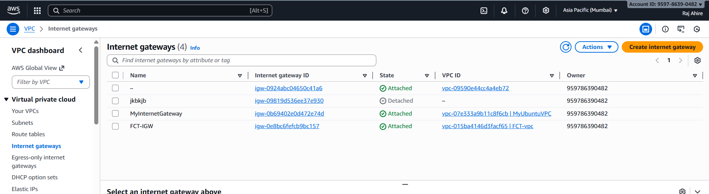
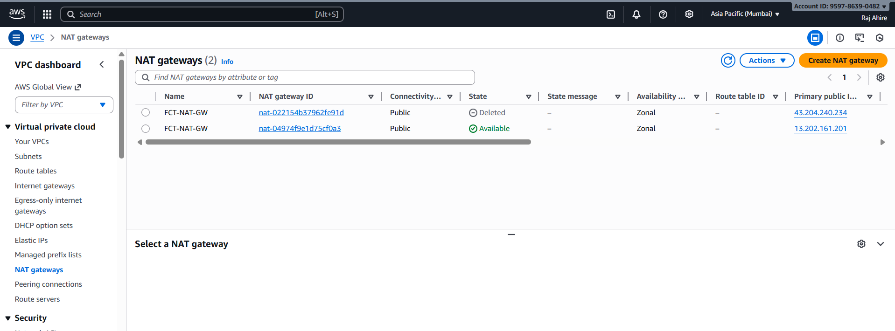
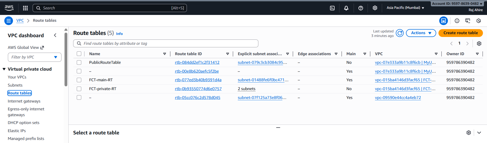
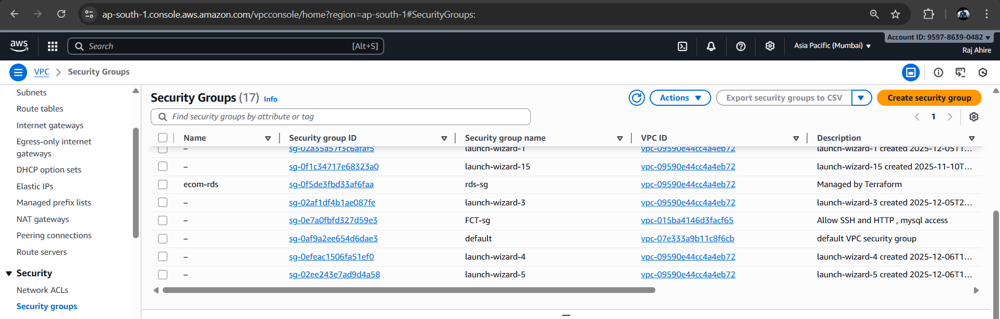
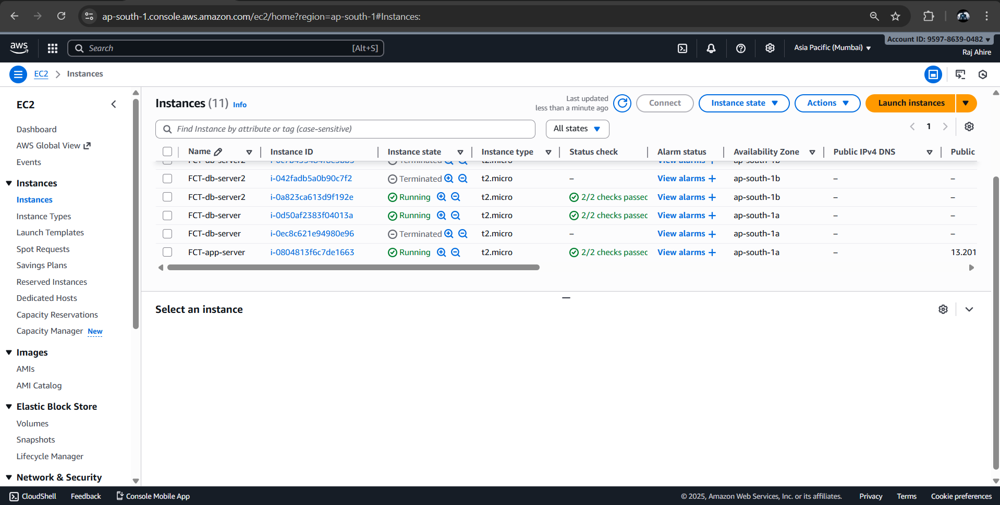
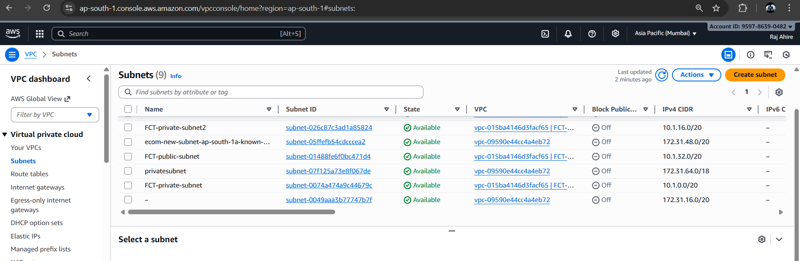
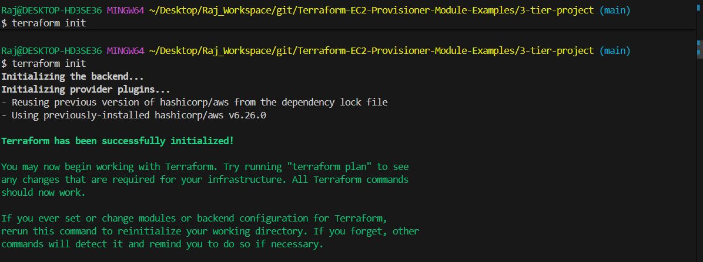
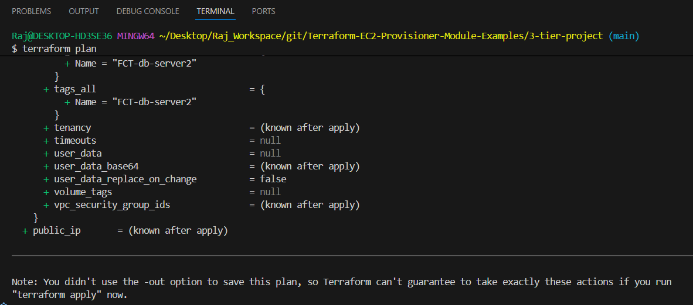
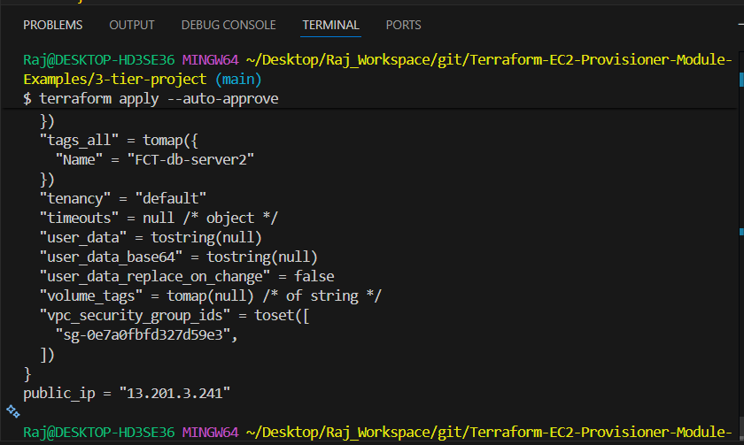
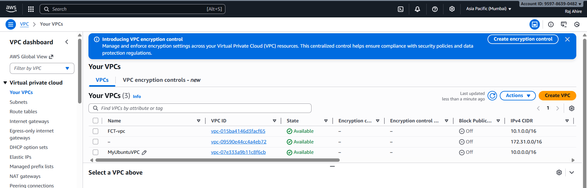

# 3-Tier Architecture on AWS using Terraform

This project provisions a fully operational **3-Tier Architecture** on AWS using Terraform.
The infrastructure includes a custom VPC, public and private subnets, routing, NAT gateway, security groups, and EC2 instances for application and database layers.

---

## Architecture Overview

```
                          Internet
                              |
                        Internet Gateway
                              |
                 ┌────────────────────────┐
                 │     Public Subnet      │
                 │  - App Server (EC2)    │
                 │  - NAT Gateway         │
                 └────────────────────────┘
                              |
                        Outbound Access
                              |
                 ┌────────────────────────┐
                 │    Private Subnets     │
                 │  - DB Server 1 (EC2)   │
                 │  - DB Server 2 (EC2)   │
                 └────────────────────────┘
```

---

# Project Structure

```
3-tier-project/
├── main.tf
├── variable.tf
├── output.tf
└── README.md
```

## Terraform Files

* [main.tf](./main.tf)
* [variable.tf](./variable.tf)
* [output.tf](./output.tf)

---

# Terraform File Highlights

## VPC Creation

```hcl
resource "aws_vpc" "my_vpc" {
  cidr_block = var.vpc_cidr
  tags = { Name = "${var.project_name}-vpc" }
}
```

---

## Public Subnet

```hcl
resource "aws_subnet" "public_subnet" {
  vpc_id                  = aws_vpc.my_vpc.id
  cidr_block              = var.public_cidr
  map_public_ip_on_launch = true
}
```

---

## Private Subnets

```hcl
resource "aws_subnet" "private_subnet" {
  vpc_id     = aws_vpc.my_vpc.id
  cidr_block = var.private_cidr
}
```

---

## Internet Gateway

```hcl
resource "aws_internet_gateway" "igw" {
  vpc_id = aws_vpc.my_vpc.id
}
```

---

## NAT Gateway + Elastic IP

```hcl
resource "aws_eip" "nat_eip" {
  vpc = true
}

resource "aws_nat_gateway" "nat_gw" {
  allocation_id = aws_eip.nat_eip.id
  subnet_id     = aws_subnet.public_subnet.id
}
```

---

## Route Tables and Routing

```hcl
resource "aws_route_table" "main_rt" {
  vpc_id = aws_vpc.my_vpc.id
}
```

```hcl
resource "aws_route" "public_route" {
  route_table_id         = aws_route_table.main_rt.id
  destination_cidr_block = "0.0.0.0/0"
  gateway_id             = aws_internet_gateway.igw.id
}
```

```hcl
resource "aws_route" "private_route" {
  route_table_id         = aws_route_table.main_rt.id
  destination_cidr_block = "0.0.0.0/0"
  nat_gateway_id         = aws_nat_gateway.nat_gw.id
}
```

---

## Security Group

```hcl
resource "aws_security_group" "main_sg" {
  vpc_id = aws_vpc.my_vpc.id

  ingress { from_port = 22 to_port = 22 protocol = "tcp" cidr_blocks = ["0.0.0.0/0"] }
  ingress { from_port = 80 to_port = 80 protocol = "tcp" cidr_blocks = ["0.0.0.0/0"] }
  ingress { from_port = 3306 to_port = 3306 protocol = "tcp" cidr_blocks = ["0.0.0.0/0"] }

  egress  { from_port = 0  to_port = 0  protocol = "-1" cidr_blocks = ["0.0.0.0/0"] }
}
```

---

## Application Server (Public EC2)

```hcl
resource "aws_instance" "app_server" {
  subnet_id              = aws_subnet.public_subnet.id
  ami                    = var.ami
  instance_type          = var.instance_type
  vpc_security_group_ids = [aws_security_group.main_sg.id]
}
```

---

## Database Servers (Private EC2)

```hcl
resource "aws_instance" "db1" {
  subnet_id              = aws_subnet.private_subnet.id
  ami                    = var.ami
  instance_type          = var.instance_type
  vpc_security_group_ids = [aws_security_group.main_sg.id]
}
```

---

# Terraform Commands

```sh
terraform init
terraform plan
terraform apply --auto-approve
```

---

# AWS Resources (Screenshots)

## Internet Gateway



## NAT Gateway



## Route Tables



## Security Groups



## EC2 Instances



## Subnets



## Terraform Init



## Terraform Plan



## Terraform Apply



## VPC



---
